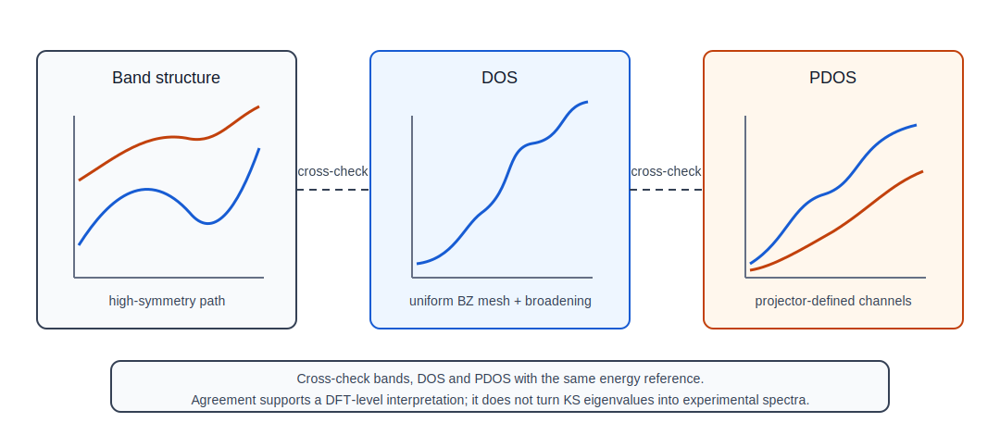

# Band structure and DOS

## 本页解决什么问题

Band structure、DOS 和 PDOS 是 QE 电子结构分析中最常被同时使用、也最容易混淆的三类证据。它们都来自 Kohn-Sham eigenvalues 和 wavefunctions，但回答的问题不同：bands 观察 `E_n(k)` 沿特定路径如何变化，DOS 统计整个 Brillouin zone 中每个能量附近有多少态，PDOS 用投影方式给出态的原子/轨道成分线索。本页给出三者的最低物理图像、能量参考和 output review 关系。



图：bands、DOS 和 PDOS 的证据边界。它说明三类图像来自不同采样和投影对象；正式结论仍需要回到对应 workflow 的 output review。

## 物理图像

周期晶体中的电子能量不是一个孤立数值，而是一组随 `k` 变化的函数 `E_n(k)`。每个 band index `n` 表示一个 Kohn-Sham 分支，每个 `k` 点表示一个 Bloch 相位。Band structure 沿高对称路径切开 Brillouin zone，展示这些分支在代表性方向上的色散、简并、交叉或开隙。

DOS 则把整个 Brillouin zone 的电子态按能量重新计数。它不关心某个态具体在路径上的哪个点出现，而关心某个能量窗口内总共有多少态。对金属、窄带、尖峰、Fermi-level 附近态密度和热/输运前置判断，DOS 对 k mesh、smearing 和 energy grid 比 band plot 更敏感。

PDOS 在 DOS 的基础上加入投影。投影把 Kohn-Sham states 投到赝势定义的 atomic-like channels 或 projector 上，用来判断某些能区主要来自哪些原子标签或轨道通道。PDOS 是解释工具，不是唯一的化学成分分解；不同 pseudopotential、projector、SOC/noncollinear 设置会改变通道含义。

电子结构图必须说明能量参考。Fermi level 是本次 occupation 和电子数下的电子化学势参考；VBM 是价带最高已占据边，CBM 是导带最低未占据边；energy zero 是绘图时人为选定的零点，可以取 Fermi level、VBM、vacuum level 或其他记录清楚的参考。若这些参考混用，bands、DOS 和 PDOS 的 gap、峰位和能带对齐就不可复查。

## 最低数学结构

Band structure 的核心对象是：

```text
E_n(k)
```

DOS 可以理解为对整个 Brillouin zone 的统计：

```text
D(E) = sum_n integral_BZ delta(E - E_n(k)) dk
```

实际计算用有限 k mesh、tetrahedron 或 smearing/broadening 近似这个积分。PDOS 在每个态上再乘以投影权重，因此它还依赖 wavefunction、projector 和 symmetry 处理。

## QE 中的对应对象

| 对象 | QE 程序 | 含义 | output 证据 |
|---|---|---|---|
| `calculation='bands'` | `pw.x` | 沿 path 求 Kohn-Sham eigenvalues | bands run output、k-point path |
| `K_POINTS crystal_b/tpiba_b` | `pw.x bands` | high-symmetry path | path sequence、labels、cell convention |
| `K_POINTS automatic` | `pw.x nscf` | DOS/PDOS 所需 uniform mesh | k-point count、irreducible k-points |
| `nbnd` | `pw.x` | 价带和目标导带窗口覆盖 | number of Kohn-Sham states |
| `bands.x` / `filband` | `bands.x` | 整理 band data | `.dat`、`.gnu`、`.rap` 文件 |
| NSCF uniform mesh | `pw.x nscf` | DOS/PDOS/Fermi surface 的上游 eigenvalues | k-point count、`nbnd`、Fermi energy |
| `dos.x` / `fildos` | `dos.x` | total DOS | energy grid、DOS file |
| `projwfc.x` / `filpdos` | `projwfc.x` | PDOS 和投影 | state labels、PDOS files |
| `occupations/smearing/degauss` | `pw.x` / `dos.x` | Fermi 附近积分处理 | occupation summary、Fermi energy |
| Fermi level / VBM / CBM / energy zero | output / plot script | 能量参考和 gap 读数边界 | Fermi energy、band edges、plot offset |

## Output 中的可见证据

- bands output 应能追踪 SCF `prefix/outdir`、k-path、number of bands、Fermi reference 和 warning。
- DOS output 应能追踪 NSCF uniform mesh、energy window、broadening、Fermi energy 和 `fildos`。
- PDOS output 应能追踪 projection labels、atomic labels、spin/SOC 分量、PDOS 文件名和 total DOS 对照。
- VBM/CBM 应说明来自哪个证据层：band path 只能搜索路径上的 extrema；uniform mesh 和 DOS 能补充全 BZ 线索，但受 smearing、energy grid 和 `nbnd` 影响。
- 若 bands 显示 gap 但 DOS 在 Fermi level 非零，必须排查 k mesh、smearing、energy zero、metallic band crossing、`nbnd` 覆盖或数据链错配。

## 对 workflow 的影响

- bands 适合观察 dispersion、direct/indirect gap 的路径线索、band crossing 和 symmetry-related features。
- DOS 适合审阅整体态密度、Fermi-level 附近态、金属性和能量窗口。
- PDOS 适合辅助解释轨道贡献，但应与 total DOS、bands、charge density 或结构信息交叉审阅。
- Fermi surface、Wannier、EPC、GW/BSE 等高级 workflow 都会继承 bands/DOS/PDOS 上游质量。

## 常见误解

- 用 band path 数据计算 DOS。
- 把 semilocal DFT band gap 写成实验 gap。
- 把 Kohn-Sham gap 写成 quasiparticle gap 或 optical gap。
- 把 DOS 曲线平滑程度当作收敛证明。
- 把 PDOS peak 面积直接解释为唯一价态或电荷转移。
- 未说明 energy zero、Fermi level、VBM/CBM 对齐方式。
- 忽略 SOC、spin polarization、noncollinear 或 DFT+U 对 band ordering 和 PDOS 通道的影响。

## PASS / WARN / BLOCK 关联

| 状态 | 证据要求 | 允许的结论 |
|---|---|---|
| PASS | bands path、NSCF uniform mesh、`nbnd`、Fermi level、VBM/CBM、energy zero、DOS/PDOS broadening 和数据链都可复查 | 可写 KS-level bands、DFT-level gap/metallicity 趋势、total DOS 或 projected DOS 的限定解释 |
| WARN | bands/DOS/PDOS 可读，但 mesh、path、smearing、`nbnd`、SOC/U 或 energy reference 仍有边界 | 只适合内部趋势、图件预审或参数敏感性讨论 |
| BLOCK | path 被当作 DOS mesh；energy zero 不明；`nbnd` 缺目标能区；DOS 与 bands 冲突未排查；KS gap 被写成实验/光学/准粒子 gap | 不允许进入正式电子结构结论或图件归档 |

## 对应 workflow

- [bands](../workflows/electronic/bands.md)
- [DOS](../workflows/electronic/dos.md)
- [PDOS](../workflows/electronic/pdos.md)
- [Fermi surface](../workflows/electronic/fermi-surface.md)
- [Kohn-Sham eigenvalue boundary](../physics-judgement/kohn-sham-eigenvalue-boundary.md)
- [band gap problem](../physics-judgement/band-gap-problem-and-delocalization.md)
- [derivative discontinuity and band-gap boundary](../physics-judgement/04-band-gap-problem-and-derivative-discontinuity.md)

## 资料来源

- QE INPUT_PW reference: <https://www.quantum-espresso.org/Doc/INPUT_PW.html>
- QE INPUT_BANDS reference: <https://www.quantum-espresso.org/Doc/INPUT_BANDS.html>
- QE INPUT_DOS reference: <https://www.quantum-espresso.org/Doc/INPUT_DOS.html>
- QE INPUT_PROJWFC reference: <https://www.quantum-espresso.org/Doc/INPUT_PROJWFC.html>
- Kohn and Sham, Self-Consistent Equations Including Exchange and Correlation Effects.
- Onida, Reining and Rubio, Electronic excitations review.
