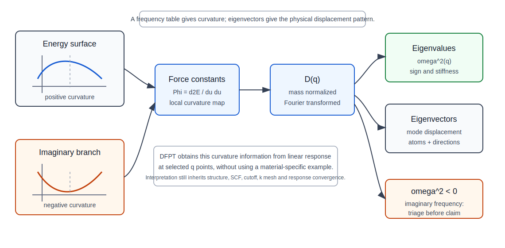

# DFPT and phonons

## 本页解决什么问题

本页解释 `ph.x` 作为 DFPT response calculation 如何从已审阅的 ground-state 数据生成 phonon 证据，并说明 Gamma phonon、q-grid phonon、`q2r.x`、`matdyn.x`、`dynmat.x`、ASR 和 imaginary frequency 在 QE output review 中如何进入 PASS / WARN / BLOCK。它直接支撑 `workflows/phonon/` 中的 Gamma、dispersion、DOS、Born/dielectric、IR/Raman 和 debugging 页面。

## 最低掌握深度

最低需要知道：

- DFPT 用线性响应求系统对原子位移、电场等微扰的响应。
- Phonon 频率来自动力学矩阵；动力学矩阵质量继承结构、SCF、cutoff、k mesh、smearing 和 response convergence 的误差。
- Gamma phonon 只审阅 zone-center modes；完整 Brillouin zone 需要 q-grid workflow。
- ASR 是 acoustic sum rule 约束和诊断工具，不替代结构优化或数值收敛。
- Imaginary frequency 需要 triage，不能直接写成真实不稳定。

## 物理图像



图：从能量面曲率到 force constants、`D(q)`、`omega^2` 和 eigenvectors 的最低物理图像；负曲率对应 imaginary frequency，需要 triage 后才能进入稳定性结论。

声子是晶体中原子集体振动的正则模式。在 Born-Oppenheimer 图像下，电子先在给定原子结构上达到基态，原子核在这个电子基态能量面上运动。若原子只在平衡位置附近小幅振动，可以把能量面对原子位移展开到二阶；二阶曲率决定 force constants，进一步决定 dynamical matrix 和 phonon frequencies。

频率平方可以看成能量曲率的符号和大小。正的曲率对应稳定振动模式；接近零的 acoustic branch 反映整体平移；负的曲率在输出中通常表现为 imaginary 或 negative frequency，需要判断它来自数值误差、结构未充分优化、边界条件、q-grid 插值问题，还是可能的真实软模和动力学不稳定。频率本身只告诉我们“某个 q 点某个模式的曲率符号和大小”，而 mode eigenvector 才告诉我们这个模式主要对应哪些原子、方向和相对位移。因此解释 soft mode 时，频率表和 eigenvector / displacement pattern 应一起审阅。

DFPT 的价值在于不用显式构造巨大超胞，也能在给定 q point 上计算原子位移微扰的线性响应。`ph.x` 计算 q 点上的 dynamical matrix；q-grid 的 dynamical matrices 经 `q2r.x` 转换为 real-space interatomic force constants，再由 `matdyn.x` 插值到 band path 或 DOS mesh。这个链条让 phonon 比普通 bands/DOS 更依赖上游 SCF、结构、cutoff、k mesh、smearing 和文件一致性。需要特别区分 direct q-point result 与 interpolation result：`ph.x` 直接求得的 q 点 dynamical matrix 是一类证据，`matdyn.x` 沿 path 插值得到的频率是另一类证据；当可疑虚频只出现在插值路径上时，应回到相近 q 点和 IFC/q-grid 审查，而不是只修改绘图。

## 最低数学结构

在 harmonic approximation 下，能量对原子位移 `u` 的展开可以理解为：

```text
E = E0 + (1/2) sum Phi u u + higher-order terms
```

`Phi` 是 force constants。经过质量归一化和 Fourier transform 后得到 dynamical matrix `D(q)`，对角化得到 `omega^2(q)` 和 mode eigenvectors。Acoustic branches 对应长波极限下的整体平移；optical branches 对应原胞内不同原子或不同自由度之间的相对运动。Acoustic sum rule 来自整体平移不应改变能量；ASR 可以约束 acoustic 行为并暴露平移不变性误差，但不能替代结构、SCF、q-grid 和 response convergence。

`q2r.x` 与 `matdyn.x` 的物理含义是把有限 q-grid 上的 dynamical matrices 转换为有限范围的 real-space IFC，再用这些 IFC 插值回任意 q 点。q-grid 太粗时，real-space IFC 的有效范围和插值质量都会受限；这类误差可能表现为 acoustic branch 漂移、局部虚频或 phonon DOS 低频端异常。

## QE 中的对应对象

| 对象 | QE 程序 | 判断意义 | output 证据 |
|---|---|---|---|
| `ph.x` | PHonon | 计算 DFPT dynamical matrices | q point、irrep、perturbation convergence |
| `tr2_ph` | `ph.x` | response 自洽阈值 | perturbation residual/convergence |
| `fildyn` | `ph.x` / `q2r.x` / `dynmat.x` | dynamical matrix 文件链 | dyn 文件列表、后处理读取记录 |
| `ldisp` / `nq1/nq2/nq3` | `ph.x` | q-grid phonon | q-point list、dyn0 和 dyn 文件完整性 |
| `q2r.x` / `flfrc` | `q2r.x` | dyn matrices -> real-space IFC | IFC 文件、q-grid 读取完整性 |
| `matdyn.x` / `asr` | `matdyn.x` | q-path interpolation 或 phonon DOS | frequencies、acoustic branches、DOS |
| `dynmat.x` | `dynmat.x` | Gamma mode analysis | mode list、Gamma frequencies |
| mode eigenvectors | `ph.x` / `dynmat.x` / `matdyn.x` | 判断振动模式的位移图像 | eigenvector、mode pattern、单位和坐标约定 |

相关 workflow：[Gamma phonon](../workflows/phonon/gamma-phonon.md)、[phonon dispersion DFPT](../workflows/phonon/phonon-dispersion-dfpt.md)、[phonon debugging](../workflows/phonon/phonon-debugging.md)。

## 核心概念

Phonon 计算的核心是 dynamical matrix。DFPT 在给定 q point 上求原子位移微扰引起的一阶响应，再由 dynamical matrix 对角化得到频率和模式。q-grid phonon 先在一组 q 点上得到 dynamical matrices，再通过 `q2r.x` 转为 real-space IFC，最后用 `matdyn.x` 插值到 q-path 或 DOS mesh。

```text
final static SCF
  -> ph.x perturbations
  -> dynamical matrices
  -> q2r.x IFC
  -> matdyn.x frequencies / DOS
```

## 对 input 的影响

- `ph.x` 的 `prefix/outdir` 必须指向可信 final static SCF。
- `tr2_ph` 控制 response 方程收敛；不能用普通 SCF 完成替代 perturbation convergence。
- q-grid dispersion 需要 `ldisp=.true.` 和 `nq1/nq2/nq3`；单个 Gamma 不足以审阅全 BZ。
- `fildyn`、`flfrc`、`flfrq`、`fldos` 是文件链参数，必须避免混用不同结构、q-grid 或 ASR 设置。
- `asr/zasr` 要记录层级和方案；它是约束/诊断，不是万能修复。
- 可疑 soft mode 应尽量区分 direct `ph.x` q-point 结果和 `matdyn.x` interpolation 结果；若只看插值曲线，容易把 IFC/q-grid 误差误判成真实软模。
- 金属 phonon 需要特别审阅 k mesh、smearing 和 Fermi-surface sampling。

## 对 output review 的影响

| output 证据 | 支持的判断 | 不能证明什么 |
|---|---|---|
| `ph.x` 读取 `prefix/outdir` | DFPT 使用目标 SCF 数据 | 上游 SCF 已对 phonon 足够 |
| q point / q-grid list | 计算对象可追踪 | q-grid 已收敛 |
| perturbation convergence | DFPT 方程完成 | cutoff/k mesh/smearing 已收敛 |
| dyn 文件完整性 | 后处理有完整输入 | dyn 来自正确结构 |
| `q2r.x` IFC | force constants 文件可追踪 | IFC 截断误差已可忽略 |
| `matdyn.x` frequency | q-path/DOS 数据生成 | 虚频来源已判定 |
| mode eigenvectors | 可疑模式的位移方向可审阅 | 虚频一定是真实不稳定 |
| acoustic branches | 平移模式和 ASR 状态 | 结构和 SCF 无误差 |
| warnings | response、symmetry、file-chain 风险 | warning 可忽略 |

## 常见误区

- `ph.x` 完成就说明 phonon 可信。
- 用 ASR 消掉异常后直接写稳定。
- 小虚频不排查。
- q-grid 不完整或 dyn/IFC/freq 文件混用。
- Gamma phonon 当作全 BZ 稳定性证据。
- phonon DOS 平滑就认为 dispersion 可信。
- 结构未充分 relax 或未做 final static SCF 就进入 `ph.x`。

## PASS / WARN / BLOCK 关联

| 状态 | 理论依据 | 下游准入 |
|---|---|---|
| PASS | 上游 final SCF 为 PASS；`ph.x` perturbations 收敛；q-grid/dyn/IFC 文件链完整；ASR、虚频和 polar correction 已审阅 | 可进入 phonon dispersion、DOS、Born/dielectric、IR/Raman 或受限热学 |
| WARN | q-grid、k mesh、smearing、ASR 或小虚频仍需敏感性检查 | 可进入诊断和复查，不应给最终稳定性结论 |
| BLOCK | 上游结构/SCF 为 BLOCK；关键 perturbation 未收敛；文件链混用；虚频未 triage；ASR 被当作修复工具 | 不允许进入 phonon 下游结论 |

## 下游影响

- `phonon DOS`：依赖可信 IFC 和 DOS q mesh。
- `Born charge / dielectric tensor`：依赖 Gamma response 分支。
- `IR/Raman`：依赖 Gamma modes 与 response tensors。
- `EPC`：继承 phonon、SCF、k/q mesh 和 smearing 的全链条误差。
- `stability statement`：必须基于 q-grid、虚频 triage 和结构审阅。

## 与 physics-judgement 的边界

本页只给 DFPT/phonon 的最低使用理论。以下问题转到：

- [phonons, soft modes and dynamical stability](../physics-judgement/09-phonons-soft-modes-and-dynamical-stability.md)
- [imaginary frequency triage](../physics-judgement/imaginary-frequency-triage.md)
- [DFPT response and polar materials](../physics-judgement/10-dfpt-response-and-polar-materials.md)
- [EPC data chain](../physics-judgement/epc-data-chain-and-convergence.md)

## 来源与边界

- Stable: `ph.x`、`q2r.x`、`matdyn.x`、`dynmat.x` 字段以 QE `INPUT_*` 为准。
- Stable: DFPT phonon 方法边界来自 Baroni et al. review。
- Boundary: 本页不判断有限温非谐效应或相变路径。

## 资料来源

- QE INPUT_PH reference: <https://www.quantum-espresso.org/Doc/INPUT_PH.html>
- QE INPUT_Q2R reference: <https://www.quantum-espresso.org/Doc/INPUT_Q2R.html>
- QE INPUT_MATDYN reference: <https://www.quantum-espresso.org/Doc/INPUT_MATDYN.html>
- QE INPUT_DYNMAT reference: <https://www.quantum-espresso.org/Doc/INPUT_DYNMAT.html>
- QE PHonon user guide: <https://www.quantum-espresso.org/Doc/ph_user_guide/>
- Baroni et al., Phonons and related crystal properties from DFPT.
- 本仓库：[phonon debugging workflow](../workflows/phonon/phonon-debugging.md)
