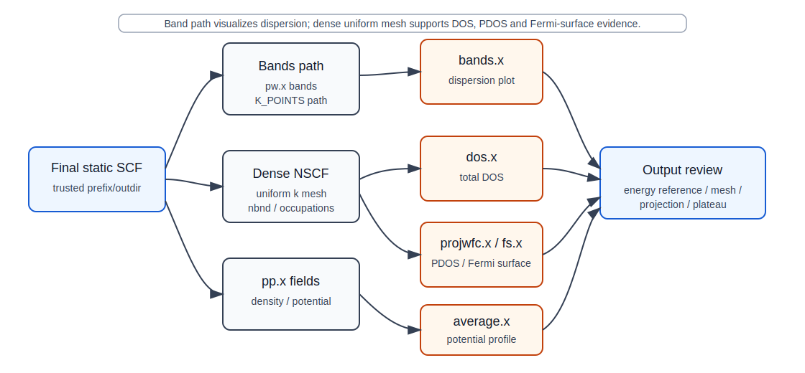

# Bands workflow

## 本页解决什么问题

本页说明如何审阅 QE 的 bands workflow：沿 high-symmetry k-path 计算 Kohn-Sham eigenvalue dispersion，并判断 band data 是否可以进入能带图、band gap 趋势、带交叉和与 DOS/PDOS 的交叉解释。bands workflow 不是 Brillouin zone 积分，不替代 DOS 的 uniform k mesh，也不自动给出实验 quasiparticle gap 或 optical spectrum。

在 QE 主线中，bands 应接在已审阅的 final static SCF 之后。若结构来自 relax/vc-relax，应先用最终结构重新做 static SCF，再基于同一 `prefix/outdir` 进行 bands 计算。

## 页面定位

- 对应学习路线：[learn/05-electronic-structure-loop.md](../../learn/05-electronic-structure-loop.md)
- 上游依赖：[workflows/ground-state/scf.md](../ground-state/scf.md)；若来自优化结构，还依赖 [workflows/ground-state/relax.md](../ground-state/relax.md) 或 [workflows/ground-state/vc-relax.md](../ground-state/vc-relax.md) 后的 final static SCF
- 理论边界：[theory-minimum/kpoints-symmetry-kpath.md](../../theory-minimum/kpoints-symmetry-kpath.md)、[physics-judgement/kohn-sham-eigenvalue-boundary.md](../../physics-judgement/kohn-sham-eigenvalue-boundary.md)
- 规范入口：[standards/output-review-checklist.md](../../standards/output-review-checklist.md)、[standards/pass-warn-block.md](../../standards/pass-warn-block.md)

## 上游依赖

- 结构、赝势、泛函、spin/SOC/DFT+U/vdW 设置已经在 SCF 记录中明确。
- `prefix/outdir` 指向已通过 output review 的 SCF ground state；不能混用不同结构、赝势、泛函或自旋设置的 scratch。
- k-path 与当前 cell convention 一致，并记录路径来源、坐标基底、端点标签和是否人工修改。
- `nbnd` 覆盖关注的价带和导带能量窗口。
- 若启用 spin polarization、noncollinear 或 SOC，图例、能带分支和简并解释必须与该模型一致。

## 计算图

```text
final static SCF on <uniform_k_mesh>
  -> pw.x calculation='bands' on <k_path>
  -> bands.x
  -> filband / filband.gnu / optional symmetry labels
  -> output review
```



图：electronic workflow 的数据边界示意。Bands path 用于色散图；DOS、PDOS 和 Fermi surface 依赖 dense uniform mesh。该图不替代本页对 `K_POINTS`、`filband`、energy reference 和 warning 的 output review。

## 关键 QE 输入对象

| 字段 / 设置 | 程序 | 控制什么 | 常见风险 | Output 中如何验证 |
|---|---|---|---|---|
| `calculation='bands'` | `pw.x` | 在给定 k-path 上求 eigenvalues | 当作新的 SCF 或 DOS mesh | `pw.x` output 的 calculation 类型和 k 点列表 |
| `prefix/outdir` | `pw.x`, `bands.x` | 连接 SCF、bands 和后处理数据 | 读取旧 scratch 或其他结构数据 | output 中读取目录、data-file 和 prefix |
| `K_POINTS crystal_b` / `tpiba_b` | `pw.x` | 定义 high-symmetry path | cell convention 与 k-path 不一致 | output 中 k 点序列、路径点数量 |
| `nbnd` | `pw.x` | 输出 bands 数量 | 导带窗口不够，图像截断 | output 中 number of Kohn-Sham states |
| `filband` | `bands.x` | band data 输出前缀 | 绘图文件来源不可追踪 | `bands.x` output 和生成的 `filband*` |
| `lsym`, `no_overlap` | `bands.x` | 对称性分类或 band ordering | band crossing 或分支解释错误 | `filband.rap`、排序行为和 warning |

## 命令与文件边界

```bash
pw.x -in pw.bands.<system>.in > pw.bands.<system>.out
bands.x -in bands.<system>.in > bands.<system>.out
```

`pw.bands.<system>.out` 记录 k-path 上的 eigenvalues；`bands.x` 将其整理为绘图数据。人工文件名不决定数据链，真正的数据边是 `prefix/outdir` 和 `filband`。`K_POINTS` path 只适合展示路径色散；若后续需要 DOS、PDOS 或 Fermi surface，应回到 uniform mesh 的 NSCF。

## Output review

| 检查项 | 从哪里看 | 能证明什么 | 不能证明什么 | WARN/BLOCK 触发 |
|---|---|---|---|---|
| 上游读取 | `pw.bands` output header、data-file 读取信息、`prefix/outdir` | bands 读取的是目标 SCF 数据 | SCF 本身已经对所有 observable 收敛 | `prefix/outdir` 错配、读取失败或结构不一致为 `BLOCK` |
| k-path | `K_POINTS` echo、k 点数量、路径标签记录 | 路径与本次输入可复查 | k-path 符合当前结构标准化 | 路径来源不明为 `WARN`；cell convention 错配为 `BLOCK` |
| bands 数量 | number of bands / Kohn-Sham states | 能量窗口覆盖程度可审阅 | 空带足以支撑所有 excited-state 解释 | 目标能区缺 bands 为 `BLOCK` |
| energy reference | Fermi energy、VBM/CBM 记录、绘图脚本 | 图中零点来源可复查 | DFT gap 等于实验 gap | 能量零点不明为 `BLOCK` |
| spin/SOC/symmetry | output 中 spin、noncollinear、SOC、symmetry 信息 | 模型分支与图例一致 | 简并或拓扑结论已成立 | SOC/磁性设置与标签不一致为 `WARN/BLOCK` |
| `bands.x` 输出 | `bands.<system>.out`、`filband`、`filband.gnu`、warning | 绘图数据来自当前计算 | 图像解释不需要人工审阅 | `filband` 缺失或 warning 未解释为 `BLOCK` |

## 收敛与可靠性

- bands 的可信度继承上游 SCF、cutoff、k-point、occupation/smearing 和结构状态。
- k-path 不做 BZ 积分，不能证明 DOS、Fermi surface 或积分型 observable 收敛。
- semilocal DFT bands 可用于 Kohn-Sham eigenvalue 趋势和 workflow 交叉检查；band gap 定量、quasiparticle gap、optical spectrum 和拓扑解释需要额外物理边界。
- relax/vc-relax 后若 cell 或 symmetry 改变，k-path 必须重新生成或重新审阅。
- energy zero 必须明确：Fermi energy、VBM/CBM 或自定义参考不能混写。

## PASS / WARN / BLOCK

| 状态 | 条件 | 是否允许进入下游 |
|---|---|---|
| `PASS` | 上游 SCF 为 `PASS`；k-path 来源清楚；`prefix/outdir` 一致；`nbnd` 覆盖目标窗口；energy reference 可复查；`bands.x` 输出完整 | 允许进入能带图、与 DOS/PDOS 交叉检查、谨慎的 KS eigenvalue 趋势解释 |
| `WARN` | k-path 或能量零点可追踪但边界不足；`nbnd` 只够探索；SOC/磁性分支需人工复核 | 只允许探索性图像和内部诊断，不用于定量 gap 或拓扑结论 |
| `BLOCK` | 上游 SCF 为 `BLOCK`；`prefix/outdir` 错配；k-path 与结构/cell convention 不一致；energy zero 不明；band data 缺失 | 不允许进入 bands 解释、图件归档或科研结论 |

## 常见误区

- 用 high-symmetry path bands 替代 DOS 或 Fermi surface 的 uniform mesh。
- relax/vc-relax 后未做 final static SCF 就直接跑 bands。
- 不记录 k-path 来源和 cell convention。
- 把 Kohn-Sham gap 写成实验 band gap。
- 绘图时移动 Fermi level 或 VBM/CBM 零点但不记录。
- 对 SOC、磁性或 DFT+U 结果沿用无 SOC/无 U 的图例和解释。

## 下游影响

bands 可进入 figures、band gap statement、DOS/PDOS cross-check、Wannier validation、EPC 或 GW/BSE 的前置审阅。进入 Wannier、EPC 或 excited-state 方法前，bands 只能作为上游质量检查，不能替代这些高级方法本身。

## 来源与边界

- QE `pw.x` input reference: <https://www.quantum-espresso.org/Doc/INPUT_PW.html>
- QE `bands.x` input reference: <https://www.quantum-espresso.org/Doc/INPUT_BANDS.html>
- SeeK-path documentation: <https://seekpath.readthedocs.io/>
- 本仓库规范：[standards/output-review-checklist.md](../../standards/output-review-checklist.md)
- 物理边界：[physics-judgement/kohn-sham-eigenvalue-boundary.md](../../physics-judgement/kohn-sham-eigenvalue-boundary.md)、[physics-judgement/04-band-gap-problem-and-derivative-discontinuity.md](../../physics-judgement/04-band-gap-problem-and-derivative-discontinuity.md)、[physics-judgement/ground-state-vs-excited-state.md](../../physics-judgement/ground-state-vs-excited-state.md)

参数定义以 QE `INPUT_PW` 和 `INPUT_BANDS` 为准；k-path 标准化和 KS eigenvalue 的物理解释属于边界判断，不能只靠 `bands.x` 正常结束来确认。
