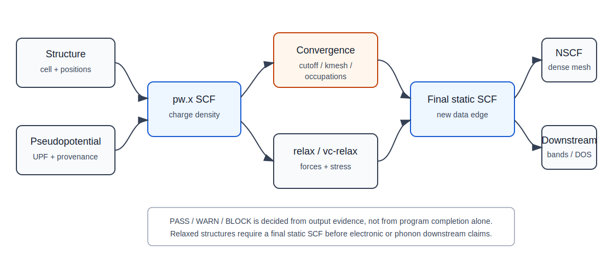

# SCF workflow

## 本页解决什么问题

本页说明如何把一次 `pw.x scf` 从“能运行的输入文件”审阅成可进入下游的 ground-state 数据边。SCF 的直接目标是建立固定结构下的 self-consistent charge density、总能和 scratch 状态；它不是 bands、DOS、phonon 或最终物性解释的替代步骤。

在 QE 主线中，SCF 位于结构和赝势之后、所有 ground-state 下游之前。一次 SCF 只有在结构、赝势、cutoff、k-points、occupations、电子收敛和 output warning 都被审阅后，才可以作为 relax、NSCF、bands、DOS、PDOS、`pp.x` 或 `ph.x` 的上游。

## 页面定位

- 对应学习路线：[learn/02-first-scf-loop.md](../../learn/02-first-scf-loop.md)
- 结构输入边界：本页只说明 QE 对结构输入的要求；结构构建与标准化在独立项目中展开。
- 规范入口：[standards/calculation-record-template.md](../../standards/calculation-record-template.md)、[standards/pass-warn-block.md](../../standards/pass-warn-block.md)

## 计算目标

SCF（self-consistent field）计算在固定原子结构下求解 Kohn-Sham 方程的自洽基态电子密度、总能、势、特征值和后续 workflow 所需的 scratch 数据。

SCF 是 QE workflow 的基础数据边。relax、bands、DOS、PDOS、phonon、charge density、potential 等步骤都依赖一个物理合理且数值收敛的 ground state。

## 上游依赖

- 已确认 `<structure>` 的晶胞、元素、原子坐标、维度和周期性边界。
- 已选择同一泛函族、来源明确、适合目标价态的 `<pseudo>`。
- 已确定初始 `<ecutwfc>`、`<ecutrho>`、`<k_mesh>` 和 occupation/smearing 策略。
- 已明确本次 SCF 的下游用途：电子结构、结构优化、声子或后处理。
- `prefix/outdir` 应为空的新 scratch、或是明确记录过的 restart；不能无记录复用旧 `.save`、旧 wavefunction 或其他 workflow 的 scratch。
- 不应混用不同结构、赝势、泛函、spin/SOC 设置或不同 QE 版本生成的 scratch 数据。

## 计算图

```text
<structure> + <pseudo> + <numerical_policy>
  -> pw.x scf
  -> converged charge density / total energy / eigenvalues / scratch state
  -> downstream workflow
```



图：ground-state workflow 的数据边界示意。SCF 是下游数据链的入口，但 relaxed structure、final static SCF 和 NSCF 各自需要独立 output review；该图不替代本页后面的 evidence table。

## 需要的 QE 程序

- `pw.x`：执行 `calculation='scf'`，生成 ground-state charge density、eigenvalues 和后续程序需要读取的 scratch 数据。
- 下游程序通过一致的 `prefix/outdir` 读取该 SCF 状态。

## 命令与文件边界

通用命令形式：

```bash
pw.x -in pw.scf.<system>.in > pw.scf.<system>.out
```

输入文件负责定义结构、赝势、数值参数、occupation 和电子收敛策略；`outdir/prefix.save` 负责保存下游读取的电荷密度、波函数和 XML 数据。文件名 `pw.scf.<system>.out` 只是人工记录名称，不等同于 QE 的数据边；下游是否读到同一次 SCF，取决于 `prefix/outdir` 和 scratch 内容是否一致。

如果本次 SCF 是 restart，记录中必须写明 restart 来源、旧 scratch 是否来自同一结构和同一 input family。若只是为了避免重新计算而复用旧 scratch，但无法证明来源一致，应按 `WARN` 或 `BLOCK` 处理。

## 通用输入模板

```fortran
&CONTROL
  calculation = 'scf',
  prefix = '<system>',
  outdir = '<scratch_dir>',
  pseudo_dir = '<pseudo_dir>',
/
&SYSTEM
  ibrav = 0,
  nat = <number_of_atoms>,
  ntyp = <number_of_species>,
  ecutwfc = <wavefunction_cutoff>,
  ecutrho = <charge_density_cutoff>,
  occupations = '<occupation_scheme>',
  smearing = '<smearing_type>',
  degauss = <smearing_width>,
/
&ELECTRONS
  conv_thr = <scf_threshold>,
  electron_maxstep = <maximum_scf_steps>,
  mixing_beta = <mixing_beta>,
  mixing_mode = '<mixing_mode>',
/
ATOMIC_SPECIES
  <Element> <Mass> <Pseudo.UPF>

ATOMIC_POSITIONS <coordinate_type>
  <Element> <x> <y> <z>

K_POINTS automatic
  <nk1> <nk2> <nk3> <sk1> <sk2> <sk3>

CELL_PARAMETERS <unit>
  <a1x> <a1y> <a1z>
  <a2x> <a2y> <a2z>
  <a3x> <a3y> <a3z>
```

## 关键 QE 输入对象

| 字段 | 作用 | 常见风险 | 输出中如何验证 |
|---|---|---|---|
| `calculation='scf'` | 固定离子位置求自洽电子基态 | 把 SCF 当结构优化 | output 开头显示 calculation 类型 |
| `prefix` | 连接同一 workflow 的 scratch 数据 | 不同任务混用同一 prefix | 下游程序使用同一 prefix |
| `outdir` | 保存 charge density、wavefunction 等中间状态 | 删除或混用旧 scratch | output 打印 temporary directory |
| `pseudo_dir` | 指向赝势目录 | 文件存在但来源混乱 | output 列出 pseudo 文件与类型 |
| `ecutwfc` | 波函数平面波 cutoff | 直接照抄而不做收敛测试 | output 中有 kinetic-energy cutoff |
| `ecutrho` | 电荷密度/势 cutoff | 对 USPP/PAW 设置过低 | output 中有 charge density cutoff |
| `occupations/smearing/degauss` | 控制占据方式 | 金属/绝缘体策略混用 | output 中有 occupation scheme 和 Fermi energy |
| `conv_thr` | 电子自洽阈值 | 过松导致下游性质不可信 | SCF iteration 的 estimated accuracy |
| `electron_maxstep` | 最大电子迭代步数 | 达到上限仍误判为成功 | output 中 SCF 是否达到最大步数 |
| `mixing_beta` | 电荷混合强度 | 金属或大胞中设太大导致振荡 | SCF 是否来回震荡 |
| `mixing_mode` | 电荷混合模式 | 不记录调参导致结果不可复查 | output 和 input record |
| `K_POINTS` | Brillouin zone 采样 | 用 bands path 做 SCF | output 中有 irreducible k-points |

这些字段分属三类：`input_dft`、spin/SOC、occupation 等属于物理模型选择；`ecutwfc/ecutrho/K_POINTS/conv_thr/mixing_*` 属于数值和迭代策略；`prefix/outdir/pseudo_dir` 属于文件链参数。三类参数不能用同一种“调大即可”的逻辑处理。

## Output review

```markdown
## Output Review

- QE 程序:
- 计算类型:
- QE version:
- Structure summary:
- Pseudopotentials loaded:
- Cutoff reported:
- K-points reported:
- Occupation / smearing:
- SCF convergence:
- SCF iterations:
- Final total energy:
- Estimated SCF accuracy:
- Fermi energy:
- Forces:
- Stress:
- Warnings:
- Restart / scratch status:
- PASS / WARN / BLOCK:
- Reason:
- Allowed downstream workflows:
```

### 必查 output 证据

| 检查项 | 从哪里看 | 能证明什么 | 不能证明什么 | WARN/BLOCK 触发 |
|---|---|---|---|---|
| 程序结束 | output 末尾 `JOB DONE` 和错误栈 | `pw.x` 正常走到结束 | 不证明 SCF 可信，也不证明参数收敛 | 无 `JOB DONE`、异常中止或输出截断为 `BLOCK` |
| 结构读取 | output 开头的 cell、atomic positions、number of atoms/types | QE 读到的结构与记录一致 | 不证明结构合理或已优化 | 原子数、元素、单位、晶胞与记录不一致为 `BLOCK` |
| 赝势读取 | pseudopotential loading 段 | 使用了哪些 UPF 文件和类型 | 不证明赝势 transferability | 文件名、元素、泛函族或相对论类型不明为 `WARN/BLOCK` |
| cutoff | kinetic-energy cutoff、charge density cutoff | `ecutwfc/ecutrho` 实际生效 | 不证明 cutoff 已收敛 | 与 input 不一致或未做目标量收敛为 `WARN` |
| k-points / symmetry | number of k points、irreducible k-points、symmetry operations | k mesh 和 symmetry 约化被 QE 采用 | 不证明 k mesh 已收敛 | 不可约 k 点异常、symmetry 与预期冲突为 `WARN` |
| occupation | occupation scheme、smearing、Fermi energy | 占据策略和 Fermi level 可审阅 | 不证明金属/绝缘体判断正确 | 金属 fixed occupation、绝缘体无理由 smearing 或 degauss 未记录为 `WARN/BLOCK` |
| SCF iteration | iteration table、`estimated scf accuracy`、convergence message | 电子自洽是否达到 `conv_thr` 语境 | 不证明 cutoff/kmesh/observable 收敛 | 达到 `electron_maxstep`、振荡或无收敛信息为 `BLOCK` |
| 总能 | final total energy | 可做同设置下相对比较和 convergence evidence | 不等于所有 observable 可信 | 单独用总能放行 force/stress/phonon 为 `WARN` |
| warning / restart | warning、restart、temporary directory、reading data-file | 文件链和运行风险 | 不证明风险可忽略 | 旧 scratch 来源不明、warning 未解释为 `WARN/BLOCK` |

## 输出判断标准

- `JOB DONE` 只说明程序结束；必须同时检查 SCF 是否达到 `convergence has been achieved`。
- `estimated scf accuracy` 应与 `conv_thr` 和下游用途匹配。
- output 中报告的 cutoff、k 点、赝势、occupation 应与 input 预期一致。
- Fermi energy、占据数和 smearing 信息应与体系的金属/绝缘体判断一致。
- warning、symmetry 改写、charge 不收敛、旧 scratch 读取等信息需要进入记录。

## 收敛与可靠性

SCF 自洽收敛不等于参数收敛。至少需要独立检查：

- `<ecutwfc>` 对总能、力、应力或目标性质的影响。
- `<ecutrho>` 对 USPP/PAW、应力和声子相关任务的影响。
- `<k_mesh>` 对总能、Fermi 附近态和下游性质的影响。
- smearing/occupation 对金属或小带隙体系的影响。

phonon 属于 DFPT response workflow，对 SCF、结构优化和收敛性要求高于普通电子结构后处理。

## PASS / WARN / BLOCK

| 状态 | 条件 | 是否允许进入下游 |
|---|---|---|
| `PASS` | `pw.x` 正常完成；结构、赝势、cutoff、k-points、occupation 与记录一致；SCF 达到电子收敛；warning 已解释；目标下游所需的 cutoff/kmesh/smearing 收敛策略已有记录 | 允许进入已声明的 relax、NSCF、bands/DOS/PDOS、`pp.x` 或 phonon 前置准备 |
| `WARN` | SCF 完成但参数只适合探索；存在已解释 warning；convergence 余量不足；Fermi energy、symmetry 或 occupation 需要进一步确认 | 只允许进入参数扫描、排错、粗略探索；不得作为最终性质上游 |
| `BLOCK` | SCF 未收敛；输出截断；结构/赝势/prefix/outdir 不一致；旧 scratch 来源不明；关键 warning 未解释；occupation 或 k-points 与目标 workflow 明显不匹配 | 不允许进入任何依赖电荷密度、波函数、总能或 eigenvalues 的下游 |

## 常见错误与诊断

| 现象 | 可能原因 | 优先排查 |
|---|---|---|
| SCF 不收敛 | `mixing_beta` 太大、smearing 不合适、结构质量差、k 点/cutoff 问题 | 先看 energy/accuracy 是否振荡，再调 mixing 和 smearing |
| 能量看似收敛但力很差 | cutoff/k 点不足，结构远离平衡 | 做结构优化或收敛性测试 |
| 下游程序找不到数据 | `prefix/outdir` 不一致或 scratch 被删 | 保持同一 prefix/outdir，记录路径 |
| 结果与外部教程数值不同 | 赝势、结构、k 点、QE 版本不同 | 比较输入来源和输出摘要，不只比较单个数值 |

## 通用学习模板

学习时应选择一个结构简单、赝势来源明确、物理状态清楚的体系，并完整记录结构、赝势、cutoff、k 点、运行命令和 output 判断。具体材料体系不写入本仓库主文档。

个人学习记录中应保留 input、output、运行命令和 output review；本页提供的是阅读任何 SCF input/output 的通用检查框架。

## 记录模板

```text
pw.scf.<system>.in
pw.scf.<system>.out
record.md
pseudo-source.md
```

`record.md` 应写清楚结构来源、赝势来源、命令、环境、收敛状态、PASS / WARN / BLOCK 判断和允许进入的下游 workflow。

## 下游影响

- `relax` / `vc-relax`：离子优化内部会反复调用电子 SCF。
- `bands`：需要先有 SCF ground state，再沿 k-path 做 bands 计算。
- `DOS/PDOS`：通常需要 SCF 后接 dense k-mesh NSCF。
- `phonon`：`ph.x` 直接依赖 SCF 产生的数据，且对 SCF 质量更敏感。

## 后续完善重点

- 将 SCF output 证据同步到 [standards/output-review-checklist.md](../../standards/output-review-checklist.md)。

## 来源与边界

- QE `pw.x` input reference: <https://www.quantum-espresso.org/Doc/INPUT_PW.html>
- QE documentation: <https://www.quantum-espresso.org/documentation/>
- Pranab Das SCF tutorial: <https://pranabdas.github.io/espresso/hands-on/scf>
- 本仓库 output review 标准：[standards/output-review-checklist.md](../../standards/output-review-checklist.md)
- 本仓库 PASS/WARN/BLOCK 标准：[standards/pass-warn-block.md](../../standards/pass-warn-block.md)

参数字段和允许值以 QE `INPUT_PW` 为准，属于 version-sensitive 内容；SCF 作为 ground-state density 数据边的判断是 stable；具体 cutoff、k mesh、smearing 和 mixing 策略只作为边界提醒，必须由目标 observable 的收敛测试决定。
