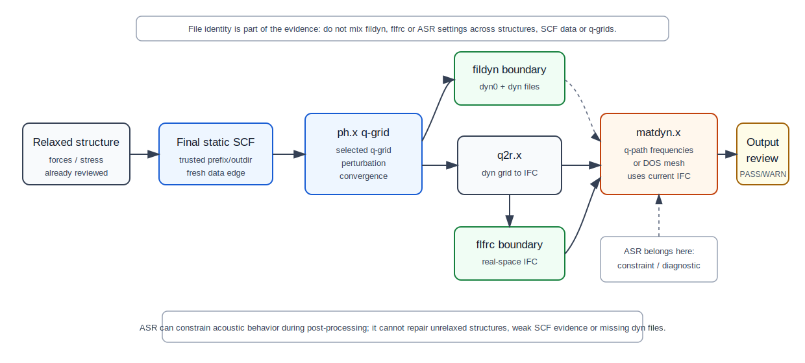

# Phonon dispersion DFPT workflow

## 本页解决什么问题

本页说明如何用 QE 的 DFPT 链条计算 phonon dispersion，并把 `ph.x`、`q2r.x`、`matdyn.x` 的文件边界和 output review 组织成可复查记录。Phonon dispersion 用于审阅动力学稳定性、软模、声学支、极性材料 LO-TO splitting 的处理边界，以及后续 phonon DOS、热学、EPC 等任务的数据质量。它不是普通电子结构后处理；任何下游结论都继承结构、SCF、cutoff、k mesh、smearing、q-grid 和 response convergence 的误差。

这页采用 reference-handbook 风格：重点不是给出某个材料的固定 q-grid、cutoff 或 k mesh，而是说明哪些 QE 对象必须同源、哪些 output 证据能让数据进入下游，以及哪些情况必须暂停。完整 dispersion workflow 的可信度来自连续链条：final static SCF 可信，`ph.x` q-grid perturbations 收敛，`q2r.x` 读取同一组 dyn 文件，`matdyn.x` 读取对应 IFC，并且虚频、ASR 和极性修正都有上下文审阅。

## 上游依赖

- 结构：已通过 `relax` 或 `vc-relax` 的力、应力、cell 审阅，并基于优化后结构重新完成 final static SCF。
- SCF：`pw.x scf` 的 `prefix/outdir`、赝势、泛函、cutoff、k mesh、occupation、smearing 已记录。
- Phonon 参数：`tr2_ph`、`ldisp`、`nq1/nq2/nq3`、`fildyn` 和 restart 策略已定义。
- 文件链：`fildyn`、`flfrc`、`flfrq`、q-path 文件必须来自同一结构、同一 SCF 数据链和同一 q-grid。
- 极性分支：若使用 non-analytic correction，需要 dielectric tensor 与 Born effective charge 的来源清楚。

## 计算图



图：DFPT phonon 链条的程序与文件边界；它强调 `fildyn`/`flfrc` 一致性和 ASR 的后处理约束角色，不能替代逐段 output review。

```text
relaxed structure
  -> pw.x final static scf
  -> ph.x with ldisp=.true. on <q_grid>
  -> dynamical matrices: <system>.dyn0, <system>.dyn1, ...
  -> q2r.x
  -> real-space force constants: <system>.fc
  -> matdyn.x on <q_path>
  -> phonon frequencies / modes / plot data
  -> output review
```

这条计算图中有三个不可混淆的文件层级。第一层是 `ph.x` 的 dynamical matrices：`fildyn` 前缀和 `dyn0/dyn1/...` 描述同一个 q-grid。第二层是 `q2r.x` 写出的 real-space interatomic force constants：`flfrc` 是从这一组 dyn 文件转换来的 IFC。第三层是 `matdyn.x` 的频率输出：`flfrq` 和绘图数据只是从当前 `flfrc` 插值得到的后处理产物。任何跨层混用都会让 dispersion 图失去 provenance，即使程序没有报错。

## 关键 QE 输入对象

Dispersion workflow 的 QE 输入对象应按阶段阅读。`ph.x` 定义 ground-state 数据来源和 q-grid response 任务；`q2r.x` 把同一 q-grid 的 dynamical matrices 转为 IFC；`matdyn.x` 只在给定 q-path 或 DOS mesh 上使用这些 IFC。`fildyn`、`flfrc` 和 `flfrq` 的名字可以相似，但语义不同，记录中必须明确哪个程序读写哪个文件。

`ph.x` q-grid:

```fortran
&INPUTPH
  prefix = '<system>',
  outdir = '<scratch_dir>',
  fildyn = '<system>.dyn',
  tr2_ph = <phonon_threshold>,
  ldisp = .true.,
  nq1 = <nq1>,
  nq2 = <nq2>,
  nq3 = <nq3>,
  recover = .true.,
/
```

`q2r.x`:

```fortran
&INPUT
  fildyn = '<system>.dyn',
  flfrc = '<system>.fc',
  zasr = '<asr_scheme>',
/
```

`matdyn.x` line mode:

```fortran
&INPUT
  flfrc = '<system>.fc',
  flfrq = '<system>.freq',
  asr = '<asr_scheme>',
  q_in_band_form = .true.,
  q_in_cryst_coord = <true_or_false>,
/
<number_of_q_path_points>
  <qx_1> <qy_1> <qz_1> <npoints_to_next>
  <qx_2> <qy_2> <qz_2> <npoints_to_next>
```

| 字段 | 程序 | 判断意义 | 联动对象 | output 中如何验证 |
|---|---|---|---|---|
| `prefix` / `outdir` | `ph.x` | 读取 final static SCF 数据 | `pw.x scf` scratch | `ph.x` header 和 warning |
| `tr2_ph` | `ph.x` | DFPT perturbation 收敛阈值 | SCF `conv_thr`、smearing | 每个 q point / perturbation 的收敛信息 |
| `ldisp` | `ph.x` | 开启 q-grid phonon | `nq1/nq2/nq3` | output 中 q-point grid 列表 |
| `nq1/nq2/nq3` | `ph.x` | Monkhorst-Pack q-grid | q2r IFC 范围、插值质量 | `<system>.dyn0` 和 dyn 文件数量 |
| `start_q` / `last_q` | `ph.x` | 分段计算 q-grid | 并行批处理、restart | 每个分段是否覆盖完整 q-grid |
| `fildyn` | `ph.x` / `q2r.x` | dynamical matrix 文件前缀 | `q2r.x` 输入 | `q2r.x` 是否读取全部 dyn 文件 |
| `flfrc` | `q2r.x` / `matdyn.x` | real-space IFC 文件 | `matdyn.x` 输入 | `matdyn.x` 是否读取当前 IFC |
| `zasr` | `q2r.x` | Born charge 相关 ASR 处理 | polar correction | `q2r.x` output |
| `asr` | `matdyn.x` | 插值阶段 ASR | acoustic branches、维度边界 | ASR 设置和 Gamma 附近声学支 |
| `q_in_band_form` | `matdyn.x` | q-path 输入形式 | 绘图路径 | `matdyn.x` 输出 q 点序列 |

## 命令与文件边界

```bash
ph.x -in ph.<system>.in > ph.<system>.out
q2r.x -in q2r.<system>.in > q2r.<system>.out
matdyn.x -in matdyn.<system>.in > matdyn.<system>.out
```

`ph.x` 生成的 dynamical matrices 必须覆盖同一个 q-grid；`q2r.x` 把这组 dyn 文件转换为 real-space interatomic force constants；`matdyn.x` 读取同一个 `flfrc` 并在指定 q-path 上插值。不能把不同结构、不同 q-grid、不同 `fildyn` 前缀或不同 ASR 方案产生的文件混用在同一张 phonon dispersion 图中。

最常见的文件链错误是把旧的 `fildyn` 前缀交给 `q2r.x`，或让 `matdyn.x` 读取另一次 `q2r.x` 生成的 `flfrc`。因此记录中应能逐项回答：`ph.x` output 是否覆盖了 `dyn0` 声明的 q-grid；`q2r.x` output 是否读取了当前这组 `fildyn*`；`matdyn.x` output 是否读取了当前 `flfrc`；最终 `flfrq` 是否只是当前后处理的产物，而不是另一次图件生成遗留的文件。

## Output review

Output review 需要按链条顺序进行，而不是先看 dispersion 图是否平滑。先确认 `ph.x` 的上游 SCF、q-grid 覆盖和 perturbation convergence；再确认 `q2r.x` 没有缺失或错读 dyn 文件；最后确认 `matdyn.x` 的 q-path、ASR、极性修正和频率符号。若任一阶段只能提供“程序结束”而没有文件和收敛证据，后续图件应降级为诊断图。

| 检查项 | 从哪里看 | 能证明什么 | 不能证明什么 |
|---|---|---|---|
| 上游 SCF | `ph.x` header、`prefix/outdir`、SCF 记录 | phonon 读取了目标 ground-state 数据 | SCF 对 phonon 目标已充分收敛 |
| q-grid 完整性 | `ph.x` q-point 列表、`dyn0`、dyn 文件列表 | q-grid 已被覆盖 | q-grid 已对目标性质收敛 |
| perturbation 收敛 | 每个 q point / irrep / perturbation 输出 | DFPT 方程在该点收敛 | cutoff、k mesh、smearing 已收敛 |
| `q2r.x` 输入 | `q2r.x` output 中读取的 `fildyn*` | IFC 来自完整 dyn 集合 | dyn 文件来自正确结构 |
| `matdyn.x` 输入 | `matdyn.x` output 中 `flfrc`、q-path、ASR | 插值使用了目标 IFC | q-path 与结构标准化一致 |
| acoustic branches | Gamma 附近频率 | 平移模式和 ASR 状态 | 虚频来源已被解释 |
| negative frequencies | 频率文件、branch、q-position | 需要进入 triage | 直接证明真实相不稳定 |
| polar correction | `epsil`/Born 输出、matdyn non-analytic 设置 | LO-TO 分支有可追踪来源 | polar correction 一定适用 |

## 收敛与可靠性

- `ph.x` 完成不等于 phonon dispersion 可用；必须逐 q point 审阅 perturbation convergence 和 warning。
- q-grid 决定 real-space IFC 的表示范围；过粗 q-grid 可能造成插值伪影。
- `matdyn.x` q-path 是可视化路径，不替代 q-grid 收敛和 phonon DOS mesh 审阅。
- ASR 可作为平移不变性约束和诊断工具，不能修复未优化结构、错误 scratch、未收敛 SCF 或缺失 dyn 文件。
- 虚频需要按位置、大小、branch、eigenvector、参数敏感性和物理情境 triage。
- 极性材料的 LO-TO splitting 与 non-analytic correction 依赖可信 dielectric tensor 和 Born effective charge；未记录来源时应降级为 WARN 或 BLOCK。

可靠性审阅应把 numerical convergence 和 physical interpretation 分开。q-grid、cutoff、k mesh、smearing 和 `tr2_ph` 的充分性只能通过目标 observable 的敏感性和 output 证据判断，本页不提供材料无关的固定推荐。虚频尤其不能只按“是否很小”处理：Gamma 附近 acoustic 行为、zone-boundary soft mode、低维体系的数值 artifact、极性修正缺失和真实结构不稳定都可能表现为负频率，需要结合 eigenvector、q-position、branch 连续性和上游结构状态判断。

## PASS / WARN / BLOCK

| 状态 | 条件 | 是否允许进入下游 |
|---|---|---|
| PASS | final static SCF 为 PASS；`prefix/outdir` 可信；`ph.x` q-grid 完整且 perturbations 全部收敛；`q2r.x` 读取当前完整 dyn 集合；`matdyn.x` 读取当前 IFC；`fildyn/flfrc/flfrq` 文件链清楚；ASR、q-path、polar correction、虚频和 eigenvector/context 审阅已记录 | 可进入 phonon DOS、图件整理、稳定性陈述和受限的下游高级 workflow |
| WARN | q-grid、cutoff、k mesh、smearing 或 `tr2_ph` 尚需加严；小 acoustic 偏差或局部低频异常已记录；polar correction、ASR 方案或 q-path convention 仍需复查 | 可进入诊断、敏感性测试和受控图件草稿，不应给定量稳定性、热学、EPC 或发表级结论 |
| BLOCK | 上游 SCF/结构为 BLOCK；没有 final static SCF；`prefix/outdir` 不可信；q-grid 不完整；`q2r.x`/`matdyn.x` 文件混用；关键 perturbation 未收敛；虚频未 triage；ASR 被用来掩盖上游问题 | 不允许进入 phonon DOS、稳定性声明、EPC、热学或发表图件 |

## 常见误区

- 只算 Gamma phonon 就声明全 BZ 稳定。
- `q2r.x` 没报错就认为 dyn 文件完整且来自当前结构。
- `matdyn.x` 插值曲线平滑就认为 phonon 结果可信。
- 未记录 ASR 与 non-analytic correction 设置。
- 对小虚频不做结构、SCF、q-grid、ASR 和 eigenvector 排查。
- 改变结构或赝势后复用旧 `fildyn`、`flfrc` 或频率文件。
- 用过粗 q-grid 支持热力学、EPC 或精细软模结论。

## 下游影响

本 workflow 是 [phonon DOS workflow](phonon-dos.md)、[phonon debugging workflow](phonon-debugging.md)、IR/Raman、热学性质和 EPC 的基础数据链。对 EPC、超导、热输运或自由能等高级任务，本页只提供 phonon 数据质量边界，不展开完整教程。

下游使用时应继承同一套文件链，而不是从图件或频率文件反向拼接 provenance。Phonon DOS 应从同一 `flfrc` 和适合 DOS 的后处理设置开始；EPC、热学和自由能任务还需要各自的电子结构、q/k sampling 和积分审阅。若 dispersion 页面为 `WARN`，下游只能做诊断；若为 `BLOCK`，所有依赖当前 `fildyn`、`flfrc` 或 `flfrq` 的后续解释都应停止。

## 来源与边界

- Stable: `ldisp`、`nq1/nq2/nq3`、`fildyn`、`tr2_ph` 以 QE `INPUT_PH` 为准；`fildyn/flfrc/zasr` 以 QE `INPUT_Q2R` 为准；`flfrc/flfrq/asr/q_in_band_form` 以 QE `INPUT_MATDYN` 为准。
- Version-sensitive: non-analytic correction、低维 ASR 选项和高级 response 分支应按当前 QE 版本文档核对。
- Boundary: 本页不规定材料无关的 q-grid、cutoff 或 k mesh；所有数值设置都以目标 observable 的收敛和 output 证据为准。
- Inference: 本页要求 final static SCF、可信 `prefix/outdir`、完整 q-grid coverage、perturbation convergence、严格 `fildyn -> flfrc -> flfrq` provenance、ASR 后处理边界和虚频 triage，是本仓库的 workflow 准入标准；它不是 QE 官方数值处方。

## 资料来源

- QE INPUT_PH reference: <https://www.quantum-espresso.org/Doc/INPUT_PH.html>
- QE INPUT_Q2R reference: <https://www.quantum-espresso.org/Doc/INPUT_Q2R.html>
- QE INPUT_MATDYN reference: <https://www.quantum-espresso.org/Doc/INPUT_MATDYN.html>
- QE PHonon user guide: <https://www.quantum-espresso.org/Doc/ph_user_guide/>
- Baroni et al., phonons and related crystal properties from DFPT, Reviews of Modern Physics.
- 本仓库：[theory-minimum/dfpt-phonons.md](../../theory-minimum/dfpt-phonons.md)、[physics-judgement/09-phonons-soft-modes-and-dynamical-stability.md](../../physics-judgement/09-phonons-soft-modes-and-dynamical-stability.md)
